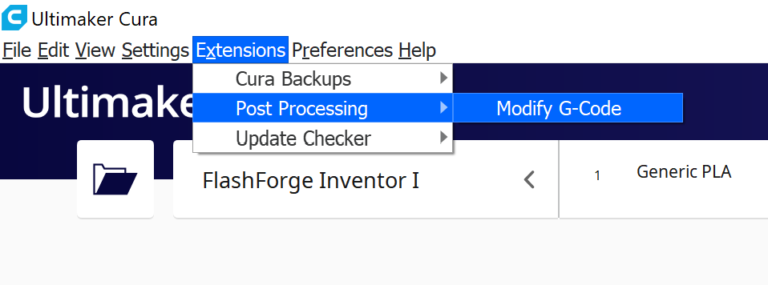
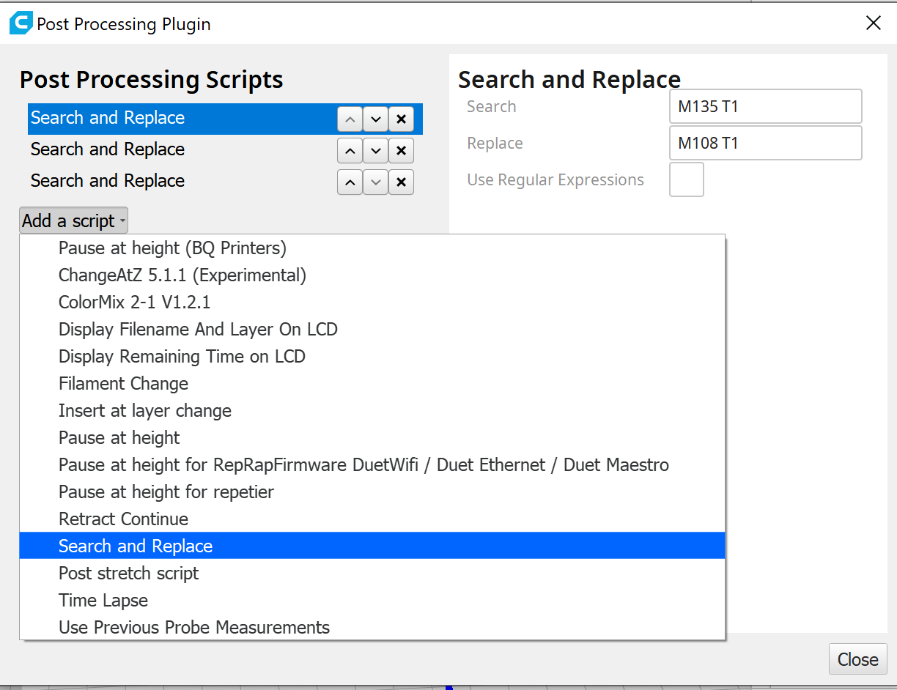

# Inventor_I_Cura
Cura Profile and resources for the Monoprice/Flashforge Inventor I 3d printer

This cura definition plus a couple find/replace scripts and post processing results in functional dual extruder prints generated by cura.
This is definitely still in progress and hopefully everything can get integrated into Cura as a single profile in the future.

## Tutorial
### install custom printer
Download this repo. navigate to C:\Users\<user>\AppData\Roaming\cura\<cura version>

copy the folders `extruders`, `definitions`, and `meshes` from this repo into the cura folder. 

launch cura and add a new printer. It should be listed under Flashforge.

### add search and replace scripts
Open the Modify G-code menu



Add a new search and replace task.



Repeat this three times for each of the following values. The order doesn't matter.


This should now work to generate basic G-code for the inventor. In order to fix up some other issues 
(cooling and heating nozzles properly when switching extruders), run the resulting gcode through process_gcode.py

```bash
python3 process_gcode.py cura_output.gcode processed.g
```
It's important to change the extension to .g, otherwise flashprint nor the printer will open it.

Launch flashprint and load the .g file. You should now be able to send it to the printer. You can also drop it directly
on the SD card if you want to skip flashprint.


# TODO
 - Figure out why the colors are sometimes inverted or the machine prints with the inactive nozzle
 - include search and replace scripts into the definition itself
 - integrate the post processing into a plugin or directly into curaengine
